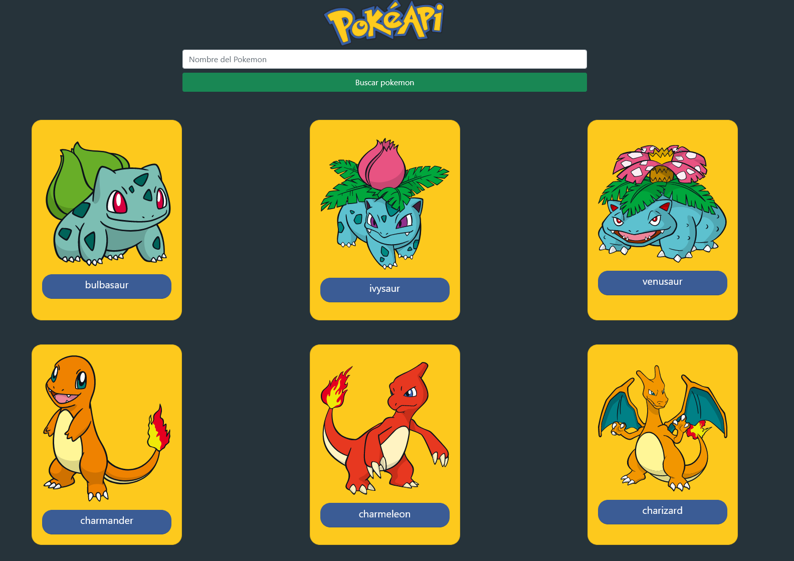

# Search pokemon



**Project made with React.js**
## Pokeapi data in:

[https://pokeapi.co/api/v2/pokemon](https://pokeapi.co/api/v2/pokemon) 
### Available Scripts

* In the project directory, you can run:

```
npm start
```

Runs the app in the development mode.\
Open [http://localhost:3000](http://localhost:3000) to view it in the browser.


